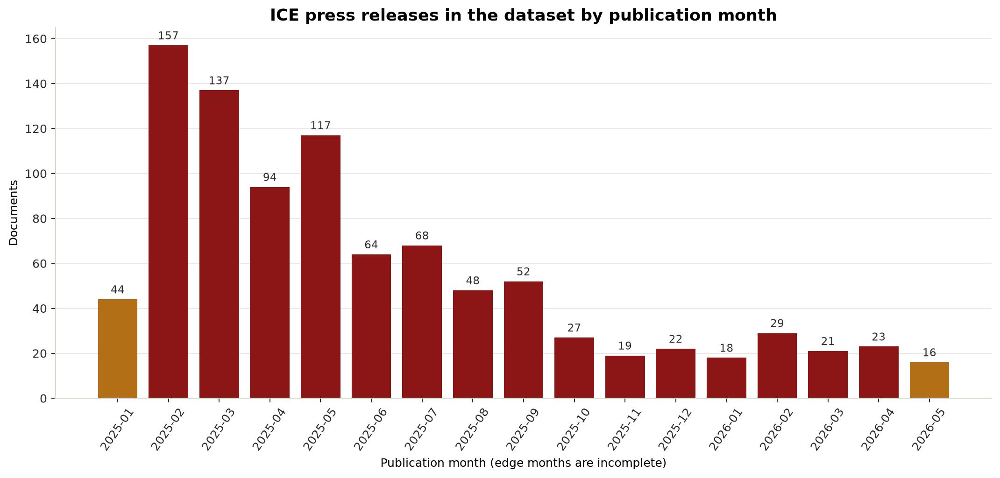
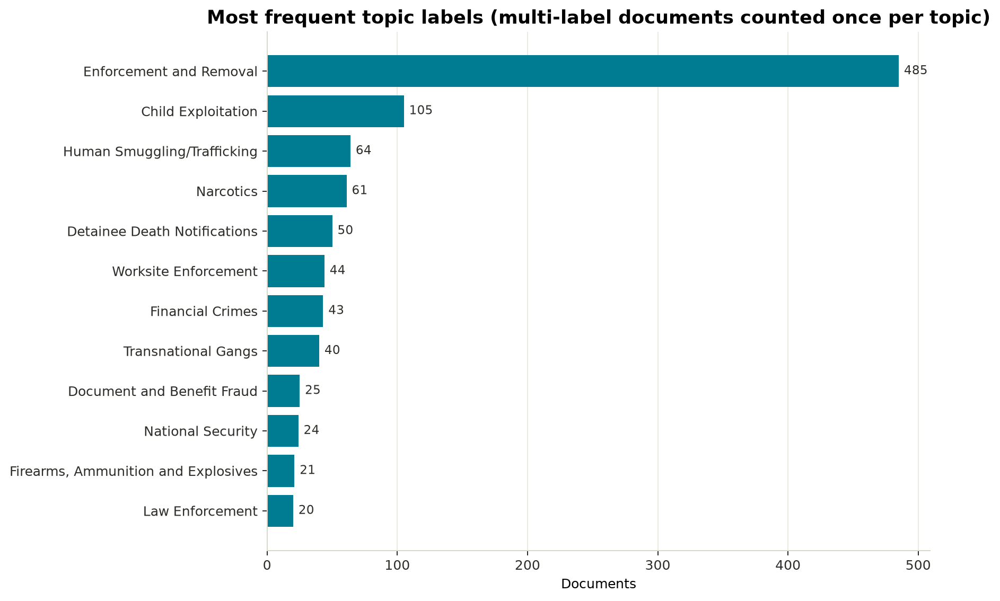
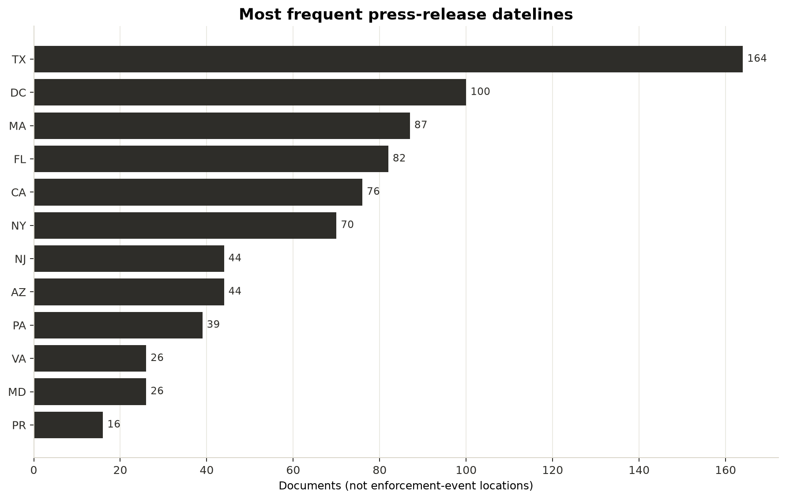

# Descriptive findings

## Scope first

These findings describe **which ICE press releases appear in this dataset and how ICE presents them**.

## Corpus coverage

- Accepted press releases: 964
- Valid publication dates: 964
- 2025–2026 releases: 956/964 (99.17%)
- Quarantined non-release pages: 1

### Largest months represented in the corpus

| Publication month   |   Documents |
|:--------------------|------------:|
| 2025-02             |         157 |
| 2025-03             |         137 |
| 2025-05             |         117 |
| 2025-04             |          94 |
| 2025-07             |          68 |

## Topics are multi-label

- Documents with known topics: 964
- Multi-topic documents: 103/964 (10.68%)

| Topic                               |   Documents | Share of documents with topics   |
|:------------------------------------|------------:|:---------------------------------|
| Enforcement and Removal             |         485 | 50.31%                           |
| Child Exploitation                  |         105 | 10.89%                           |
| Human Smuggling/Trafficking         |          64 | 6.64%                            |
| Narcotics                           |          61 | 6.33%                            |
| Detainee Death Notifications        |          50 | 5.19%                            |
| Worksite Enforcement                |          44 | 4.56%                            |
| Financial Crimes                    |          43 | 4.46%                            |
| Transnational Gangs                 |          40 | 4.15%                            |
| Document and Benefit Fraud          |          25 | 2.59%                            |
| National Security                   |          24 | 2.49%                            |
| Firearms, Ammunition and Explosives |          21 | 2.18%                            |
| Law Enforcement                     |          20 | 2.07%                            |

## Datelines are communication geography

| Metadata dateline region   |   Documents | Share of populated regions (n=964)   |
|:---------------------------|------------:|:-------------------------------------|
| TX                         |         164 | 17.01%                               |
| DC                         |         100 | 10.37%                               |
| MA                         |          87 | 9.02%                                |
| FL                         |          82 | 8.51%                                |
| CA                         |          76 | 7.88%                                |
| NY                         |          70 | 7.26%                                |
| AZ                         |          44 | 4.56%                                |
| NJ                         |          44 | 4.56%                                |
| PA                         |          39 | 4.05%                                |
| MD                         |          26 | 2.70%                                |
| VA                         |          26 | 2.70%                                |
| PR                         |          16 | 1.66%                                |

